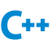

# Hey, I'm *tiredy*

👋 Welcome to my GitHub profile! I'm an aspiring software developer with a passion for coding! While I'm not currently employed as a developer, I'm actively working on honing my skills and building projects to gain hands-on experience.

## About Me

- 🌱 Aspiring beginner/junior developer
- 🌈 Pronouns: any, i don't care.. 🗿
- 💻 Knowledge in (java)Java, (javascript)JS and (cpp)C++
- 🚀 Working on personal projects to enhance my skills
- 🎯 Eager to learn new things and collaborate on projects

## My Projects

🕸️ Coming soon.. 🕸️

## Social

If you want to contact me I'm currently only on discord
but feel free to reach out if want to discuss anything or just have a chat!

 Discord: tiredy [^numbers]
## Skills

**Languages:**
 -  JavaScript
 -  Java
 -  C++
 -  Python

**Workspace:**
- IDE:
  -  VS Code
  -  IntelliJ Idea
  -  CLion
  
- System:
  -  OpenSuse
  -  Tiny11

- Build Tools:
  -  Gradle
  -  CMake
  
- Version Control:
  -  Git

## Goals

I'm currently working towards:

- Expanding my knowledge in cmake and git.
- Learning to contribute to open-source projects.
- Improving my skills in java and c++.
- Creating my personal webpage.

## Thank You

Thanks for visiting my github profile! There may not be much here at the moment but I'm working on changing that!

## Notes
[^numbers]: Where's the #1234? - Discord has recently changed and now the numbers aren't required.
